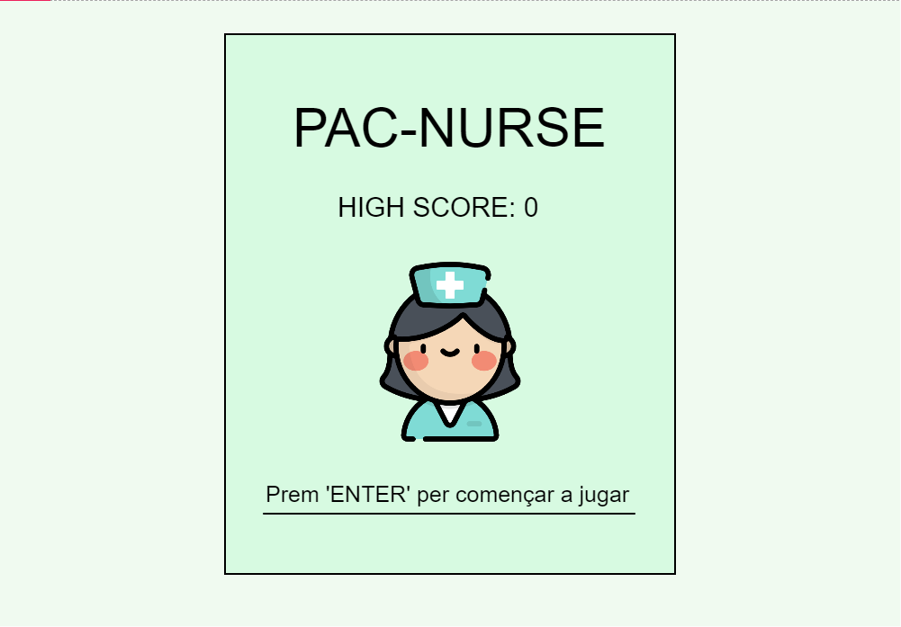
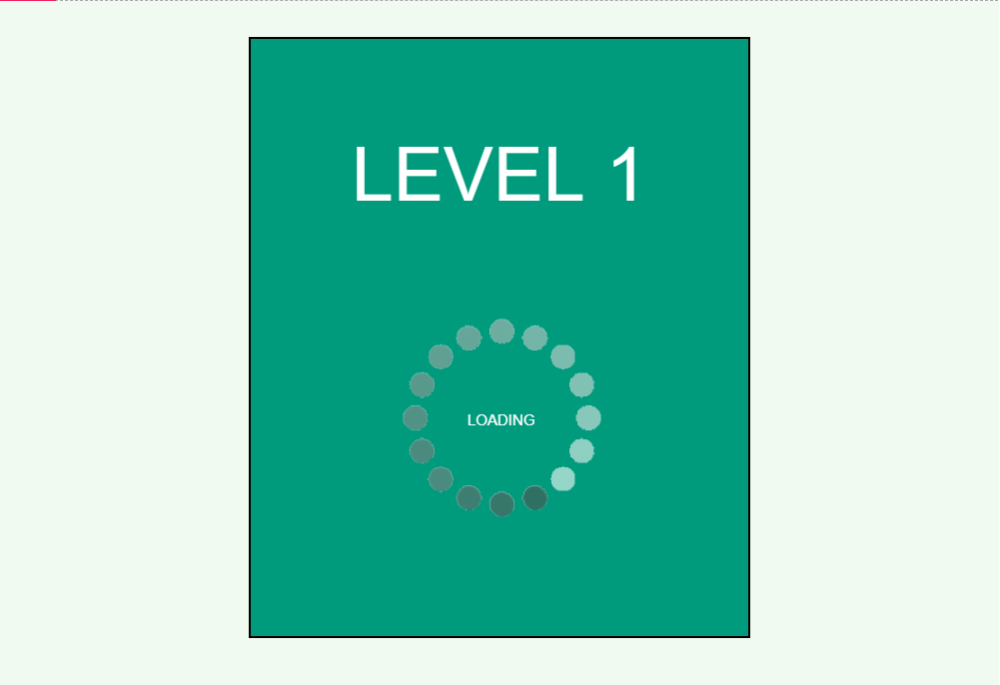
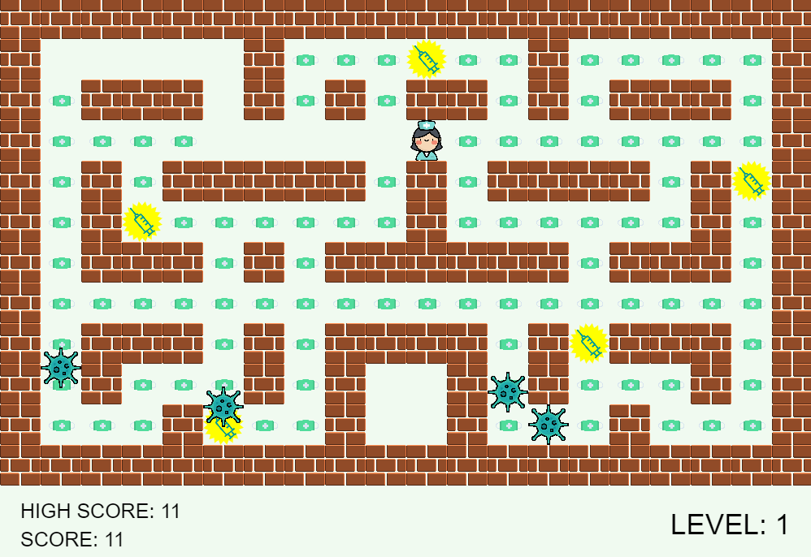
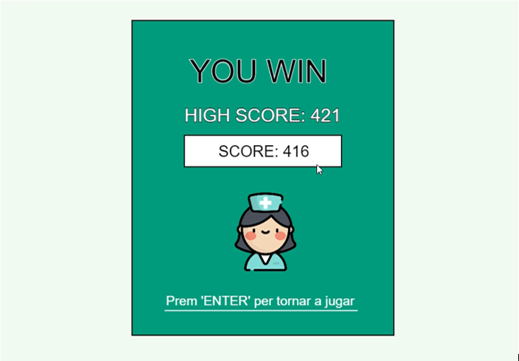

# Videogame Production - Code Documentation

# Pac-Nurse

**Link to play the game: [pac-nurse](https://editor.p5js.org/marinaurpi267/full/NOSOekFOf)**

## Gameplay
*Pac-Nurse* is a game based on the original game *PAC-MAN*. I wanted to make a game that shaped our global situation, the pandemic. I thought it was a good choice to star a nurse and put Covid-19 as the antagonist. Masks help you to raise your score as a metaphor of our actual situation. Our bonus is a vaccine that gives you enough power to kill the virus.
* On the main page, we have to press 'ENTER' to access level 1.
* We have to use arrows from our keyboard to move us around.
* You must get all masks spread across the game board to pass to the next level. Some virus will be going around there and if they touch you… **GAME OVER**
* Every time you get a vaccine you have the choice to kill the virus and get easily more masks.
* You can raise your score with every mask you get and every virus you kill.
* There are 3 levels, each one more difficult than the previous one, and when you pass the last one you **WIN** the game.

### Goals
* Beat your own high score
* Get all the masks to level up
* Get the vaccines to be able to beat the viruses
* Pass third level and win the game

### Difficulties
* Virus speed
* Random movement of the virus
* Beat your own high score

## Pac-Nurse's Assets

* **Images**
  * block.png
  * loading.gif
  * mascara.svg
  * nurse.png
  * vacuna.png
  * virus.png

* **Audio**
  * aplausos.mp3
  * enemyDead.mp3
  * gameOver.mp3
  * levelup.mp3
  * power.mp3
  * resistire.mp3

* **Files**
  * virusTime.json
  * index.html
  * sketch.js
  * style.css
  * enemy.js
  * nurse.js
  * gameOver.js
  * levelup.js
  * start.js
  * win.js

## Images of Scenes

### Home

### Loading

### Game Scene

### Game Over 

### Win 

